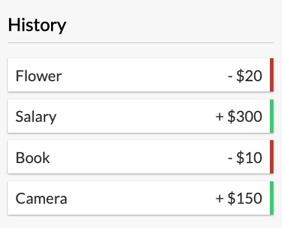
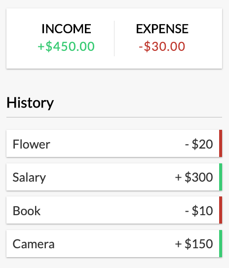

# JavaScript Desctructuring

## Arrays

### Advanced Scenarios

#### Desctructuring with Ternary Operator

**Use Case**
Inside a React component that produces list items we have two dynamic values based on the ` amount ` prop passed in.  One will determine the class name we set and other displays a ` +/- ` sign in front of the number.

Instead of calculating them separately we can simply return an array inside each returned element of a Ternary Operator and then immediately destructure the returned array providing us instant access to the two variables we need inside the JSX return statement.

```javascript
import React from 'react'

export const Transaction = ({t}) => {

  const {text, amount} = t;
  const [sign, signClass] = (amount < 0 ? ['-', 'minus'] : ['+', 'plus']);

  return (
  <li className={signClass}>
    {text} <span>{`${sign} $${Math.abs(amount)}`}</span><button className="delete-btn">x</button>
  </li>
)}
```



**Use Case**
Inside a React component that sums and displays separately income (positive) and expense (negative).

Inside a single ` reduce() ` function we can calculate both income and expense at the same time instead of calculating them separately. We can simply return an array inside each returned element of a Ternary Operator with the calculation already performed and then immediately destructure the returned array providing us instant access to the two variables we need inside the JSX return statement.

```javascript
import React, { useContext } from 'react'
import { GlobalContext } from '../context/GlobalState';

export const IncomeExpenses = () => {

  const { transactions } = useContext(GlobalContext);
  const [income, expense] = transactions.reduce((prev, curr) => {
    return ((curr.amount > 0) ? [prev[0] + Math.abs(curr.amount), prev[1]] : [prev[0], prev[1] + Math.abs(curr.amount)]);
  }, [0, 0]);

  return (
    <div className="inc-exp-container">
      <div>
        <h4>Income</h4>
        <p className="money plus">+${income.toFixed(2)}</p>
      </div>
      <div>
        <h4>Expense</h4>
        <p className="money minus">-${expense.toFixed(2)}</p>
      </div>
    </div>
  )
}
```


